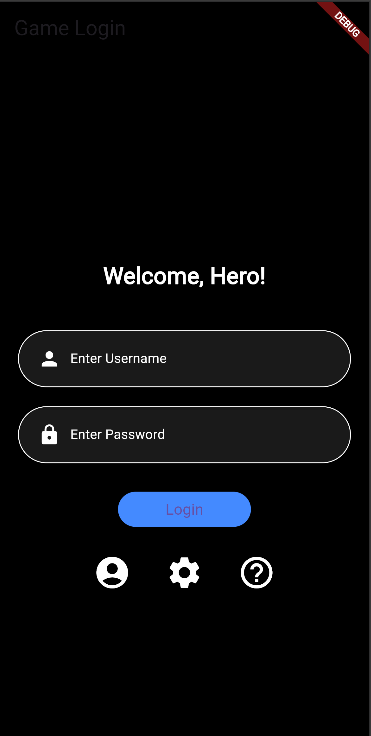
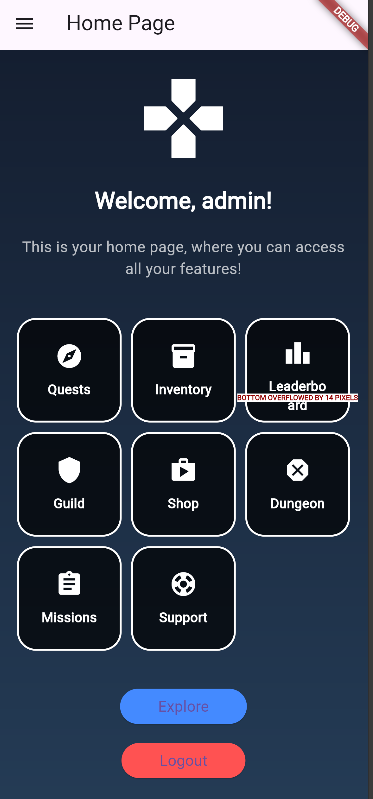
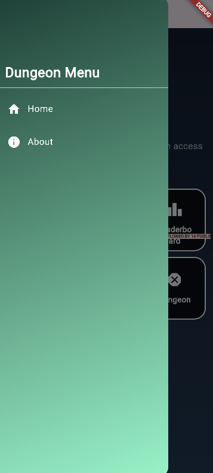
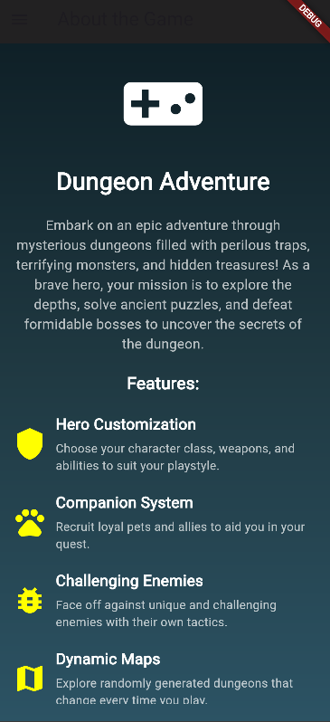

# Game App - Flutter

## Deskripsi
Aplikasi ini adalah demo aplikasi game berbasis Flutter dengan fitur login, navigasi melalui menu samping, dan berbagai halaman yang merepresentasikan elemen-elemen game seperti quest, inventory, leaderboard, dan lainnya.

## Fitur Utama
- **Login**: Autentikasi sederhana menggunakan `SharedPreferences` untuk menyimpan nama pengguna secara lokal.
- **Home Page**: Halaman utama yang menyambut pengguna setelah login dengan tampilan ala game dan akses cepat ke berbagai fitur.
- **Side Menu**: Navigasi cepat ke halaman lain seperti About dan pengaturan aplikasi.
- **Custom Fonts & Theme**: Menggunakan font khusus untuk memberikan kesan game retro pada aplikasi.

## Struktur Proyek

### `main.dart`
File utama yang menjadi entry point aplikasi.
```dart
void main() {
  runApp(const MyApp());
}

class MyApp extends StatelessWidget {
  @override
  Widget build(BuildContext context) {
    return MaterialApp(
      title: 'Game App',
      home: const LoginPage(), // Halaman pertama yang muncul adalah LoginPage
    );
  }
}
```
- Menginisialisasi aplikasi dengan halaman awal `LoginPage`.

### `login_page.dart`
Halaman login untuk autentikasi pengguna.
- **StatefulWidget** digunakan untuk menangani perubahan status seperti input pengguna.
- **`_saveUsername()`**: Menyimpan nama pengguna ke dalam `SharedPreferences`.
- **`_showDialog()`**: Menampilkan dialog ketika login berhasil atau gagal.
- Tombol **Login** memeriksa apakah username dan password yang diinput adalah 'admin'. Jika benar, menyimpan username dan mengarahkan ke halaman `HomePage`.

### `home_page.dart`
Halaman utama yang ditampilkan setelah pengguna berhasil login.
- **`_loadUsername()`**: Memuat nama pengguna dari `SharedPreferences`.
- Tampilan halaman menggunakan `Stack` dan `Container` untuk background gradien serta `Column` untuk menampilkan pesan selamat datang dan fitur-fitur.
- **`_buildFeatureGrid()`**: Membuat grid yang menampilkan beberapa fitur seperti `Quests`, `Inventory`, `Leaderboard`, `Settings`, `Shop`, dan `Support`.

### `sidemenu.dart`
Komponen menu samping untuk navigasi.
- Menyediakan navigasi ke halaman `Home` dan `About`.
- Menggunakan `Drawer` dan `ListTile` untuk membuat item menu yang interaktif.

### `about_page.dart`
Halaman informasi tentang aplikasi.
- Menampilkan deskripsi aplikasi, tujuan, dan informasi pembuat aplikasi.

## Customisasi
- **Font & Theme**: Menggunakan font custom `PressStart2P` untuk memberikan kesan game retro. Tema aplikasi juga menggunakan warna gelap dengan gradien untuk latar belakang.
- **Ikon & Desain**: Setiap fitur pada halaman `HomePage` ditampilkan dalam bentuk grid dengan ikon yang berbeda.


## Instalasi
1. Pastikan Flutter dan Dart sudah terinstal pada sistem.
2. Clone repository ini.
3. Jalankan perintah `flutter pub get` untuk mengunduh semua dependencies.
4. Jalankan aplikasi dengan perintah `flutter run`.


## ScreenShot






